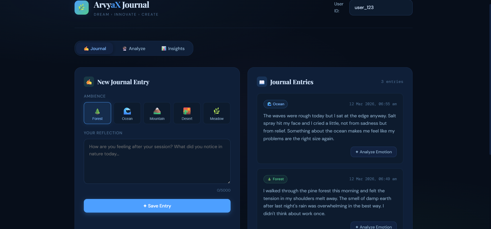

# 🌿 ArvyaX — AI-Assisted Journal System

> *Dream › Innovate › Create*

A full-stack journaling platform that blends nature-immersive wellness sessions with AI-powered emotional analysis, giving users meaningful insights about their mental state over time.

---

## ✦ Features

- **Journal Entries** — Write and store reflections tied to nature ambiences (forest, ocean, mountain, desert, meadow)
- **LLM Emotion Analysis** — Detect emotions, extract keywords, and summarize mental state using Claude claude-haiku-4-5-20251001
- **Streaming Analysis** — Real-time streaming LLM responses via Server-Sent Events
- **Insights Dashboard** — Aggregated stats: top emotion, favourite ambience, keyword trends, breakdown charts
- **Analysis Cache** — SQLite-backed deduplication of identical text analyses (SHA-256 hash)
- **Rate Limiting** — 100 req/15min global; 10 req/min on the analyze endpoint
- **Docker** — Full `docker-compose` setup for one-command deployment

---

## ⚡ Quick Start

### Prerequisites
- Node.js 18+
- An [API key](https://console.anthropic.com/)

### 1. Clone & Configure

```bash
git clone <repo-url>
cd arvyax-journal
```

**Backend:**
```bash
cd backend
cp .env.example .env
# Edit .env and set API_KEY=your_key_here
```

### 2. Install & Run Backend

```bash
cd backend
npm install
npm start
# API running at http://localhost:3001
```

### 3. Install & Run Frontend

```bash
cd frontend
npm install
npm start
# App running at http://localhost:3000
```

### 4. Or use Docker (recommended)

```bash
# Copy and fill in your API key
cp .env.example .env
echo "API_KEY=your_key_here" > .env

docker-compose up --build
# Frontend: http://localhost:3000
# Backend:  http://localhost:3001
```

---

## 🔌 API Reference

### `POST /api/journal`
Create a journal entry.

**Request:**
```json
{
  "userId": "user_123",
  "ambience": "forest",
  "text": "I felt calm today after listening to the rain."
}
```

**Response `201`:**
```json
{
  "id": "uuid",
  "userId": "user_123",
  "ambience": "forest",
  "text": "I felt calm today after listening to the rain.",
  "emotion": null,
  "keywords": [],
  "summary": null,
  "createdAt": "2024-01-15T10:30:00"
}
```

---

### `GET /api/journal/:userId`
Retrieve all entries for a user.

**Query params:** `limit` (default 50), `offset` (default 0)

**Response:**
```json
{
  "entries": [...],
  "total": 12,
  "limit": 50,
  "offset": 0
}
```

---

### `POST /api/journal/analyze`
Analyze emotion in text using LLM.

**Request:**
```json
{
  "text": "I felt calm today after listening to the rain",
  "entryId": "optional-uuid-to-update-entry"
}
```

**Response:**
```json
{
  "emotion": "calm",
  "keywords": ["rain", "nature", "peace"],
  "summary": "User experienced deep relaxation during the forest session",
  "cached": false
}
```

**Streaming** (add `"stream": true`):  
Returns `text/event-stream` with delta chunks. See frontend `api.streamAnalysis()`.

---

### `GET /api/journal/insights/:userId`
Aggregated mental health insights.

**Response:**
```json
{
  "totalEntries": 8,
  "topEmotion": "calm",
  "mostUsedAmbience": "forest",
  "recentKeywords": ["focus", "nature", "rain"],
  "emotionBreakdown": { "calm": 5, "joyful": 2, "anxious": 1 },
  "ambienceBreakdown": { "forest": 4, "ocean": 3, "mountain": 1 }
}
```

---




## 🛠 Tech Stack

| Layer     | Technology                       |
|-----------|----------------------------------|
| Backend   | Node.js + Express                |
| Database  | SQLite (via `better-sqlite3`)    |
| LLM       | Anthropic Claude claude-haiku-4-5-20251001 (via REST API) |
| Frontend  | React 18                         |
| Styling   | Pure CSS (no UI library)         |
| Caching   | SQLite analysis cache table      |
| Rate Limit| `express-rate-limit`             |
| Docker    | `docker-compose` with nginx      |

---

## 📁 Project Structure

```
arvyax-journal/
├── backend/
│   ├── src/
│   │   ├── index.js          # Express app + middleware
│   │   ├── db.js             # SQLite init + schema
│   │   ├── routes/
│   │   │   └── journal.js    # All API endpoints
│   │   └── services/
│   │       └── llm.js        # LLM + cache + streaming
│   ├── .env.example
│   ├── Dockerfile
│   └── package.json
├── frontend/
│   ├── src/
│   │   ├── App.js            # All React components
│   │   ├── index.css         # Global styles
│   │   └── utils/api.js      # API client
│   ├── public/index.html
│   ├── Dockerfile
│   ├── nginx.conf
│   └── package.json
├── docker-compose.yml
├── README.md
└── ARCHITECTURE.md
```

---

## 🔐 Environment Variables

| Variable          | Required | Description                          |
|-------------------|----------|--------------------------------------|
| `API_KEY`         | ✅       |  API key                             |
| `PORT`            | ❌       | Backend port (default: 3001)         |
| `FRONTEND_URL`    | ❌       | CORS origin (default: localhost:3000)|
| `DB_PATH`         | ❌       | SQLite file path                     |
